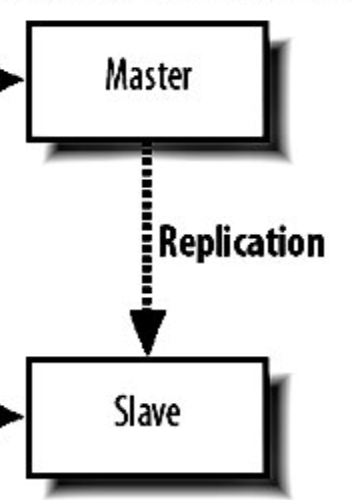
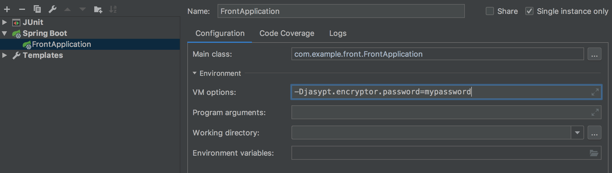

# Front Project


### 사용

- spring boot 2.3.4.RELEASE
- redis
- maven
- jasypt


---


## 기타정리


### 캐시란

- 캐시란 데이터를 임시로 저장해두는 장소를 말합니다.

- 네트워크(통신)에 대한 부담,DB에 접속하지 않고 데이터를 갖고있어 부담을 줄이고 성능을 높여줍니다.

- 80:20 법칙에 따라 20%의 데이터가 전체 조회 건수의 80%를 차지할 경우 캐시를 사용이 적합함


---


### Redis vs Memcached

Redis 장점

- 디스크에 데이터를 기록하고 있기 때문에, Redis 메모리가 날라가도 데이터를 복구 가능

( 스냅샷을 떠서, 이를 사용하는 RDB 방식과 Write / Update Event를 로그에 남겨서 이를 기반으로 복구하는 AOF 방식 두가지가 있다. )

- 다양한 데이터 포맷을 지원

  String, List, Set, Sorted sets, Hash 등의 데이터 포맷을 지원기능을 간편하게 구현할 수 있다. 예를 뜰면 BITMAP 데이터 구조와 BITCOUNT 함수를 사용하면 일일 유니크 방문자수를 간단하게 구현할 수 있다.  ( 참고 - REDIS - 3.6 BITMAP )

- 데이터 삭제 정책이 다양

Memcached는 LRU 삭제 정책만 지원한다고 한다.

- 한 개의 키에 저장할 수 있는 VALUE의 범위가 Memcached에 비해 더 크다. 

Redis는 512MB인 반면, memcached는 1MB까지 저장할 수 있다. 


Redis 단점

- 메모리를 2배로 사용

   레디스는 싱글 스레드이다. 그래서 스냅샷을 뜰 때, 자식 프로세스를 하나 만들낸 후 

   새로 변경된 메모리 페이지를 복사해서 사용한다.

   레디스는 copy-on-write 방식을 사용하고 있지만, 

   보통 레디스를 사용할 때는 데이터 변경이 잦기 때문에 실제 메모리 양만큼의 메모리를 자식 프로세스가 복사하게 된다.

   그래서 실제로 필요한 메모리 양보다 더 많은 메모리를 사용하게 된다.

- 레디스는 메모리를 직접 처리할 수 없어서, 메모리 파편화가 발생하기 쉽다.


Memcached 장점

- memcached는 DB / API 통신을 줄이기 위해 데이터를 캐싱처리하는 데에 사용하면 좋은 캐시

- 레디스는 트래픽이 몰리면, 응답속도가 불안정하다고 한다.

   반면, 트래픽이 몰려도 Memcached의 응답 속도는 안정적인 편이라고 한다. 

- memcached는 내부적으로 slab 할당자를 사용하고 있어서, 메모리 파편화 문제가 덜하다.

   그러나,  데이터 변경이 잦은 경우, 메모리 파편화가 발생하기 쉽다. 때문에 memcached는 한 번 입력후, 변경되지 않는 정보를 저장할 때 유용하다.

- 레디스에 비하면 메타 데이터를 적게 사용하기 때문에 메모리 사용량이 상대적으로 낮다. 


Memcached 단점

- 레디스처럼 데이터 타입과 API가 다양하지 않다. 


---


## 출저
ttps://americanopeople.tistory.com/148 [복세편살]


### ec2 - mysql vs rds - mysql

* 데이터베이스 서버를 ec2에서 설치하여 관리를 직접 하느냐, AWS에게 관리를 양도하느냐의 차이다.

* 데이터베이스를 전문적으로 관리하는 인력이 없거나 리소스가 부족한 상황이라면 RDS를 사용하여 관리하는게<br>
비용적으로 좀 더 들수 있지만 종합적으로 효율적이다.

* ec2인스턴스를 생성하고 mysql설치하고 외부 접속 설정을 하고 DB이중화를 하고 한시간이 넘을 작업량이지만(작업자의 역량에 따라 시간은 다를 수 있음)<br>
RDS를 사용하여 DB 이중화까지 한시간이 걸리지 않았음(RDS를 처음사용해봐 설정법을 찾는게 좀 불편하긴 했음)

>> 결론은 작업자의 역량과 리소스상황에 맞게 선택하여 사용하면 됩니다. 이 프로젝트에는 빠른 구축을 위해 RDS를 사
 


### DB 이중화

* master db에서는 insert , update ,delete 작업 , slave db에서는 read용으로 사용

* mysql replication을 통해 데이터 복제



#### replication 장점

* DB 서버 부하 분산

* master db 장애시 slave db로 대체 가능

#### replication 단점

* Master-Slave pair 관리:서버들이 많아질 경우, Master와 Slave의 짝을 관리하는 것이 쉽지 않다.

* 실패 상황에서의 복구 : Master가 실패시 Master와 Slave의 교체, 혹은 Slave의 데이터를 Master로 복사하는 등의 작업을 수동으로 진행하여야 한다. Slave의 실패인 경우도 마찬가지이다.

* binary log의 관리: Master 에 쌓이는 binary log에 대한 관리 또한 수동으로 처리하여야 한다.(cron등을 이용하여 정기적인 삭제 필요)

* replication 지연발생: Master의 처리량이 많은 경우 Slave는 지연시간이 발생하게 되고 그 시간동안의 데이터는 일치하지 않는 문제가 있다.


## 출저
https://hibrainapps.tistory.com/129 [하이브레인넷 부설연구소]

---

### application.properties 값 암호화

application.properties 에 입력한 DB정보와 같은 민감한 정보가 소스에 노출되는 것에 보안상에 고민이었는데<br>
`jasypt-spring-boot-starter`를 통해 처리를 하였습니다.


`pom.xml`

```xml

<!-- application.porperties 암호화 -->
<dependency>
    <groupId>com.github.ulisesbocchio</groupId>
    <artifactId>jasypt-spring-boot-starter</artifactId>
    <version>3.0.3</version>
</dependency>
<dependency>
    <groupId>org.bouncycastle</groupId>
    <artifactId>bcprov-jdk15on</artifactId>
    <version>1.66</version>
</dependency>

```

`config class`


```java

@Configuration
public class PropertyEncyptConfiguration {

    @Bean("encryptorBean")
    public PooledPBEStringEncryptor stringEncryptor() {
        String mypassword = System.getProperty("jasypt.encryptor.password");
        PooledPBEStringEncryptor encryptor = new PooledPBEStringEncryptor();
        encryptor.setProvider(new BouncyCastleProvider());
        encryptor.setPoolSize(2);
        encryptor.setPassword(mypassword);
        encryptor.setAlgorithm("PBEWithSHA256And128BitAES-CBC-BC");
        return encryptor;
    }
}

```

setPassword에 해당하는 값을 그대로 코드에 담기에는 이부분도 보안상 문제가 되기때문에<br>
System property값을 입력하여 가져오도록 처리함.<br>

application을 jar파일로 실행할 때 -Djasypt.encryptor.password=mypassword입력 vm option을 줘서 실행해준다.<br>

그러면 코드에 passsword 그대로 노출되는게 아니라 코드에서 받아서 password값을 받아서 세팅할 수 있다.<br>




```java

String mypassword = System.getProperty("jasypt.encryptor.password");

```

아래와 같이 jasypt.encryptor.bean도 설정해줘야한다.
PropertyEncyptConfiguration class에 등록한 빈이름을 넣어준다.


`application.properties`

```properties

jasypt.encryptor.bean=encryptorBean
jasypt.encryptor.property.prefix=ENC(
jasypt.encryptor.property.suffix=)

```


테스트 코드를 통해 간단히 확인도 가능하다.

```java

@RunWith(SpringRunner.class)
@SpringBootTest
public class PropertyEncyptConfigurationTest extends TestCase {
    @Test
    public void EncyptConfiguration_확인(){
        PooledPBEStringEncryptor encryptor = new PooledPBEStringEncryptor();
        encryptor.setProvider(new BouncyCastleProvider());
        encryptor.setPoolSize(2);
        encryptor.setPassword("xoxo");
        encryptor.setAlgorithm("PBEWithSHA256And128BitAES-CBC-BC");

        String plainText = "test";
        String encryptedText = encryptor.encrypt(plainText);
        String decryptedText = encryptor.decrypt(encryptedText);
        System.out.println(encryptedText);
        assertTrue(plainText.equals(decryptedText));
    }
}


```


## 출저
https://goateedev.tistory.com/131